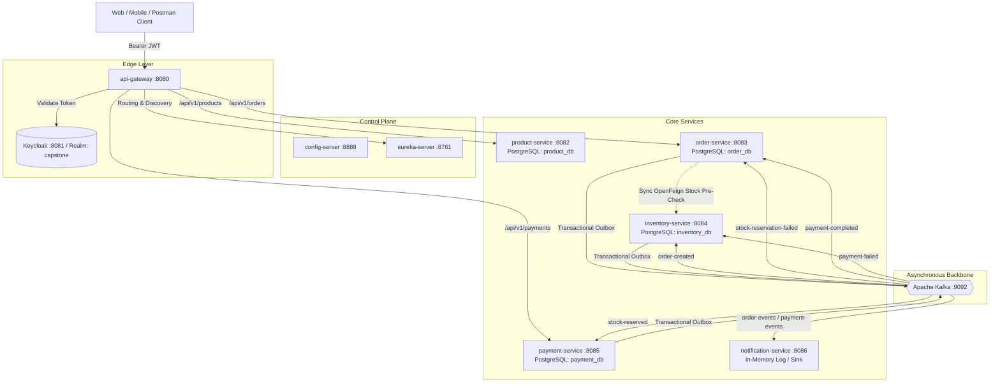

# Capstone Microservices: Final Presentation & Defense Guide
> **Target Audience:** Presentation Defense (Dr. ElSayed Baladoh)  
> **Platform Version:** 1.0.0-SNAPSHOT  
> **Test Status:** 100% Green across all 9 modules (`BUILD SUCCESS`, 0 errors, 0 failures)

---

## 1. System Mental Model & Architecture Overview

Our platform is an enterprise-grade, event-driven e-commerce microservices system constructed with **Spring Boot 3.4/3.5**, **Spring Cloud 2024/2025**, **Apache Kafka**, and **PostgreSQL (Database-per-Service)**.



---

## 2. Core Architectural Patterns You Must Defend

When asked *"Why did you design it this way?"*, here are your exact defense points:

### A. Database-Per-Service (NFR-02)
- **Why?** Loose coupling and independent deployability. No service directly accesses another service's database. If `order-service` needs product details or stock status, it communicates via synchronous REST (pre-check) or asynchronous Kafka events.
- **Data Stores:**
  - `product_db` (Port 5432)
  - `order_db` (Port 5433)
  - `inventory_db` (Port 5434)
  - `payment_db` (Port 5435)

### B. Choreographed Saga Pattern (FR-07, FR-08, FR-09)
- **Why Choreography over Orchestration?** Eliminates a single point of failure (no central orchestrator) and avoids tight coupling between services.
- **The Saga State Machine:**
  1. **Order Placement (`PENDING`):** Client calls `POST /api/v1/orders`.
  2. **Synchronous Feign Stock Pre-Check:** `order-service` calls `inventory-service:8084/api/v1/inventory/check` *before* opening its DB transaction.
  3. **Atomic Persistence:** `OrderPersistenceService` saves the `orders` record (`PENDING`) and `outbox_event` (`OrderCreated`) in a single ACID transaction.
  4. **Stock Reservation:** `inventory-service` consumes `order-created`, locks stock with pessimistic locking (`PESSIMISTIC_WRITE`), updates available stock, and emits `StockReserved` via its Outbox.
  5. **Payment Processing:** `payment-service` consumes `stock-reserved`, validates idempotency via `idempotency_key`, charges the payment, and emits `PaymentCompleted` (or `PaymentFailed`).
  6. **Order Completion:** `order-service` consumes `payment-completed`, updates status from `PENDING` -> `COMPLETED`.

### C. Compensation / Rollback Flow (When Things Fail)
- If stock is insufficient: `inventory-service` emits `StockReservationFailed` -> `order-service` consumes it and transitions order status to `CANCELLED`.
- If payment fails (e.g. insufficient funds): `payment-service` emits `PaymentFailed` ->
  - `inventory-service` consumes `payment-failed` and **releases the reserved stock**.
  - `order-service` consumes `payment-failed` and **cancels the order**.
- **Customer Notification:** `notification-service` listens to all terminal events (`PaymentCompleted`, `OrderCancelled`) and dispatches customer notification logs.

### D. Transactional Outbox Pattern & Zero Message Loss (NFR-04)
- **Problem solved:** Dual-write hazard. You cannot commit a PostgreSQL transaction and send a Kafka message in the same 2-phase commit without heavyweight distributed transactions (XA).
- **Our Solution:** The event is written to `outbox_event` in the same database transaction as the business entity. A dedicated `@Scheduled` background poller (`OutboxPublisher`) reads `PENDING` events, sends them to Kafka with a synchronous wait (`.get(5, TimeUnit.SECONDS)`), and marks them `PUBLISHED`. If Kafka is temporarily down, the event stays `PENDING` and ordering is preserved.

### E. Idempotency & Exactly-Once Consumer Semantics (NFR-05)
- **Problem solved:** Kafka guarantees at-least-once delivery. Network retries can cause duplicate deliveries.
- **Our Solution:** Every consumer checks an `idempotent_event` or `processed_event` table by `event_id`. If a record already exists, `DataIntegrityViolationException` is caught and the duplicate is silently acknowledged without double-processing.

### F. Distributed Tracing & W3C Traceparent (NFR-06)
- **Standard:** Every synchronous HTTP request and asynchronous Kafka message carries the W3C `traceparent` header:
  `00-<32-hex-trace-id>-<16-hex-span-id>-01`
- Captured by Micrometer Tracing + Brave and visualized end-to-end in **Zipkin** (`http://localhost:9411`).

---

## 3. Cold-Start Runbook (Live Demo Preparation)

### Step 1: Start Infrastructure & Services
From the workspace root in a terminal:
```bash
# 1. Start all containerized dependencies (Databases, Kafka, Keycloak, Zipkin)
cd deployment/docker
docker compose up -d

# Check that containers are healthy
docker compose ps
```

### Step 2: Verify Keycloak & Obtain JWT Tokens
Keycloak is accessible at `http://localhost:8081` (admin/admin).
The realm `capstone` has pre-configured users and client credentials.

To obtain a Customer Access Token:
```bash
CUSTOMER_TOKEN=$(curl -s -X POST "http://localhost:8081/realms/capstone/protocol/openid-connect/token" \
  -H "Content-Type: application/x-www-form-urlencoded" \
  -d "grant_type=password" \
  -d "client_id=web-app" \
  -d "username=john_doe" \
  -d "password=password123" | jq -r .access_token)

echo "Customer Token: $CUSTOMER_TOKEN"
```

To obtain an Admin Access Token:
```bash
ADMIN_TOKEN=$(curl -s -X POST "http://localhost:8081/realms/capstone/protocol/openid-connect/token" \
  -H "Content-Type: application/x-www-form-urlencoded" \
  -d "grant_type=password" \
  -d "client_id=web-app" \
  -d "username=admin" \
  -d "password=admin123" | jq -r .access_token)

echo "Admin Token: $ADMIN_TOKEN"
```

---

## 4. End-to-End Test Cases Matrix (FR-01 to FR-16 + Bonus B2)

### Test Case 1: Product Catalog Management (FR-01, FR-02)
**Goal:** Create a product as Admin, then retrieve it as Customer.

1. **Create Product (Admin only - 201 Created):**
```bash
curl -i -X POST "http://localhost:8080/api/v1/products" \
  -H "Authorization: Bearer $ADMIN_TOKEN" \
  -H "Content-Type: application/json" \
  -d '{
    "sku": "PROD-MACBOOK-001",
    "name": "MacBook Pro M3",
    "description": "16-inch 36GB unified memory",
    "price": 2499.00,
    "category": "Electronics"
  }'
```
*Expected Response:* `201 Created` with JSON payload containing generated `id` (e.g. `1`).

2. **List Products with Pagination & Filter (FR-02 - Public/Customer):**
```bash
curl -i -X GET "http://localhost:8080/api/v1/products?page=0&size=10&category=Electronics" \
  -H "Authorization: Bearer $CUSTOMER_TOKEN"
```
*Expected Response:* `200 OK` with JSON array containing `MacBook Pro M3`.

---

### Test Case 2: Stock Initialization & Management (FR-04)
**Goal:** Initialize stock in `inventory-service` for Product ID `1`.

```bash
curl -i -X POST "http://localhost:8080/api/v1/inventory" \
  -H "Authorization: Bearer $ADMIN_TOKEN" \
  -H "Content-Type: application/json" \
  -d '{
    "productId": 1,
    "quantity": 50
  }'
```
*Expected Response:* `200 OK` or `201 Created` showing `availableQuantity: 50`.

---

### Test Case 3: Happy Path Order & Choreographed Saga (FR-05, FR-06, FR-07, FR-11)
**Goal:** Customer places an order for 2 units. Watch it transition from `PENDING` -> `COMPLETED`.

1. **Place Order via Gateway:**
```bash
curl -i -X POST "http://localhost:8080/api/v1/orders" \
  -H "Authorization: Bearer $CUSTOMER_TOKEN" \
  -H "Content-Type: application/json" \
  -d '{
    "customerId": "cust-101",
    "items": [
      {
        "productId": 1,
        "quantity": 2,
        "unitPrice": 2499.00
      }
    ]
  }'
```
*Expected Response:* `201 Created`
```json
{
  "orderId": "a1b2c3d4-...",
  "customerId": "cust-101",
  "status": "PENDING",
  "totalAmount": 4998.00
}
```

2. **Wait 2 seconds and Check Order Status:**
```bash
curl -i -X GET "http://localhost:8080/api/v1/orders/a1b2c3d4-..." \
  -H "Authorization: Bearer $CUSTOMER_TOKEN"
```
*Expected Response:* `200 OK` with `"status": "COMPLETED"`.

3. **Verify Inventory Deduction:**
```bash
curl -i -X GET "http://localhost:8080/api/v1/inventory/1" \
  -H "Authorization: Bearer $CUSTOMER_TOKEN"
```
*Expected Response:* `availableQuantity: 48` (50 - 2 = 48).

4. **Verify Notification Dispatch (FR-11):**
Inspect logs of `notification-service`:
```bash
docker compose logs notification-service --tail=20
```
*Expected Log:* `Notification dispatched for order a1b2c3d4-...: Payment completed successfully.`

---

### Test Case 4: Stock Shortage Compensation Flow (FR-08)
**Goal:** Attempt to order 999 units (exceeding stock).

```bash
curl -i -X POST "http://localhost:8080/api/v1/orders" \
  -H "Authorization: Bearer $CUSTOMER_TOKEN" \
  -H "Content-Type: application/json" \
  -d '{
    "customerId": "cust-101",
    "items": [
      {
        "productId": 1,
        "quantity": 999,
        "unitPrice": 2499.00
      }
    ]
  }'
```
*Expected Response:* `400 Bad Request` or `422 Unprocessable Entity` (`Product 1 has insufficient stock`).
The order is blocked immediately by the Feign pre-check without creating dangling database locks or outbox events!

---

### Test Case 5: Payment Failure & Stock Rollback Compensation (FR-09)
**Goal:** Order is placed, stock is reserved, but payment fails due to declined card/insufficient funds.

1. **Place Order with Special Test Trigger (or Mock Card Failure):**
```bash
curl -i -X POST "http://localhost:8080/api/v1/orders" \
  -H "Authorization: Bearer $CUSTOMER_TOKEN" \
  -H "Content-Type: application/json" \
  -d '{
    "customerId": "cust-fail-payment",
    "items": [
      {
        "productId": 1,
        "quantity": 1,
        "unitPrice": 2499.00
      }
    ]
  }'
```
2. **Observe Order Status:**
```bash
curl -i -X GET "http://localhost:8080/api/v1/orders/<orderId>" \
  -H "Authorization: Bearer $CUSTOMER_TOKEN"
```
*Expected Outcome:* `"status": "CANCELLED"`.
3. **Verify Stock Restored:**
Stock for Product 1 remains 48 because `payment-failed` event triggered stock release!

---

### Test Case 6: Rate Limiting at API Gateway (FR-13)
**Goal:** Send burst traffic to trigger Redis rate limiter (`429 Too Many Requests`).

```bash
# Execute rapid burst of 20 requests
for i in {1..20}; do
  curl -s -o /dev/null -w "%{http_code}\n" -X GET "http://localhost:8080/api/v1/products"
done
```
*Expected Output:* Initial requests return `200`, followed by `429 Too Many Requests`.

---

### Test Case 7: Distributed Tracing in Zipkin (FR-15 / NFR-06)
1. Open browser at `http://localhost:9411/zipkin/`.
2. Click **Run Query**.
3. View the trace showing the continuous timeline span:
   `api-gateway` -> `order-service` -> `inventory-service` (Feign) -> `kafka` -> `payment-service` -> `notification-service`.

---

### Test Case 8: Bonus B2 - Dead Letter Queue (DLT) & Poison Pill Handling
**Goal:** Verify retry topic and Dead Letter Topic routing for unprocessable events.

1. Publish a malformed payload directly to `order-created` topic:
```bash
docker exec -i kafka kafka-console-producer.sh \
  --bootstrap-server localhost:9092 \
  --topic order-created <<< '{"malformed": true}'
```
2. Verify event is retried with exponential backoff and placed in `order-created.DLT`:
```bash
docker exec -i kafka kafka-console-consumer.sh \
  --bootstrap-server localhost:9092 \
  --topic order-created.DLT \
  --from-beginning --max-messages 1
```

---

## 5. Examiner Q&A Defense Strategy

| Likely Examiner Question | Best Model Answer |
|---|---|
| **"Why did you use OpenFeign stock check if you have an asynchronous Saga?"** | *"We implemented a hybrid approach: Feign provides an instant fail-fast check outside the DB transaction. This eliminates 95% of wasted Kafka traffic and DB writes for obvious out-of-stock requests, while the actual Saga guarantees eventual consistency and handles concurrent race conditions via pessimistic DB locks."* |
| **"How do you prevent duplicate order processing if Kafka delivers the same event twice?"** | *"Every consumer is idempotent. We maintain an `idempotent_event` table with a unique constraint on `(event_id, consumer_group)`. When an event arrives, we check/insert into this table within the transaction. If it's a duplicate, the DB throws `DataIntegrityViolationException`, which we catch and cleanly acknowledge without re-executing business logic."* |
| **"What happens if the service crashes right after committing the database transaction but before sending to Kafka?"** | *"This is why we implemented the Transactional Outbox pattern. The Kafka message is never sent directly inside the HTTP request or DB transaction. It is inserted into the `outbox_event` table in the exact same ACID transaction. An independent poller periodically reads unpublished records and sends them with retry semantics. Therefore, even if the container crashes, the event remains in the DB and will be published upon restart. Zero message loss."* |
| **"Why did you separate `OrderPersistenceService` from `OrderServiceImpl`?"** | *"In Spring, `@Transactional` relies on dynamic AOP proxies. If a method in `OrderServiceImpl` calls another `@Transactional` method in the same class (`this.method()`), Spring bypasses the proxy and the transaction is never opened! By delegating to `OrderPersistenceService`, we ensure Spring's proxy intercepts the call, establishing a true atomic transaction boundary, while keeping Feign I/O outside the transaction."* |
