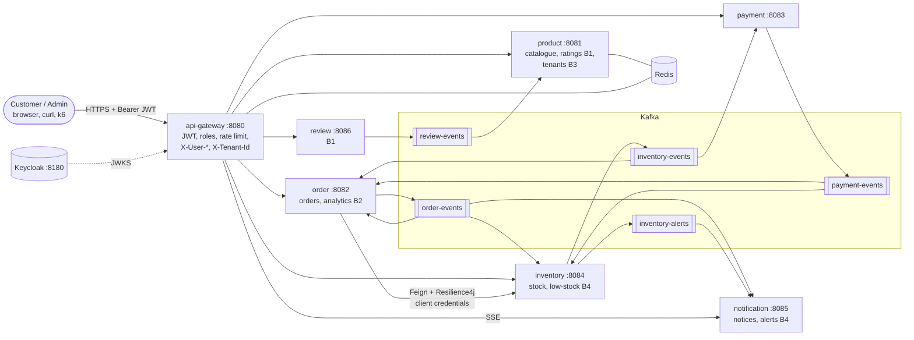
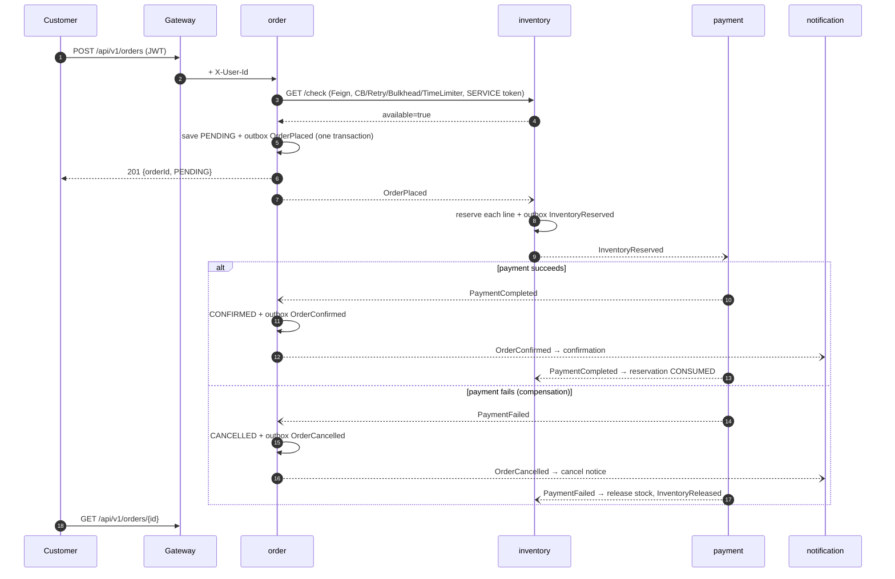
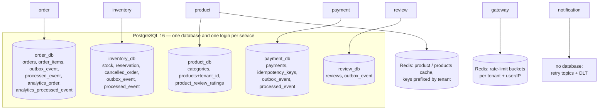

# Architecture diagrams

Digital versions of the three views the Brief asks for (§10.3), kept in sync with the code. The **paper drawings**
themselves must be drawn and photographed by the team and added here (`01-…jpg`, `02-…jpg`, `03-…jpg`).
`01-bonus-boundaries.svg` is Member C's drawing of the B2 boundaries.

## 1. Service boundaries (Core + Bonuses)

## 2. Place-order flow: happy path and one failure path

## 3. Where data lives (table → database)

